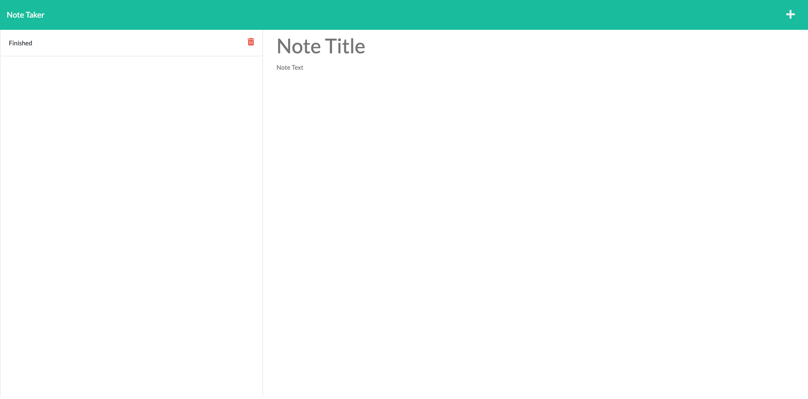

# Note Taker

## Description

Note taker app allows user to write and save notes so that they can organize their thoughts and keep track that they need to complete.

## Installation

Node.js
express.js

## Link

https://mighty-cliffs-56502.herokuapp.com/ 
https://drive.google.com/file/d/14M7yaxN_h0SNpbXJNMKMV81M2dOVNZFx/view?usp=share_link 

## Usage

In the command-line user will run node server.js in the Note Taker folder. Then user will be able to run it in the local file using http://localhost:3001/notes. Alternatively user can also go to https://mighty-cliffs-56502.herokuapp.com/ my heroku deployed app.

## Credits

Kevin

## License

Please refer to the LICENSE in the repo.

